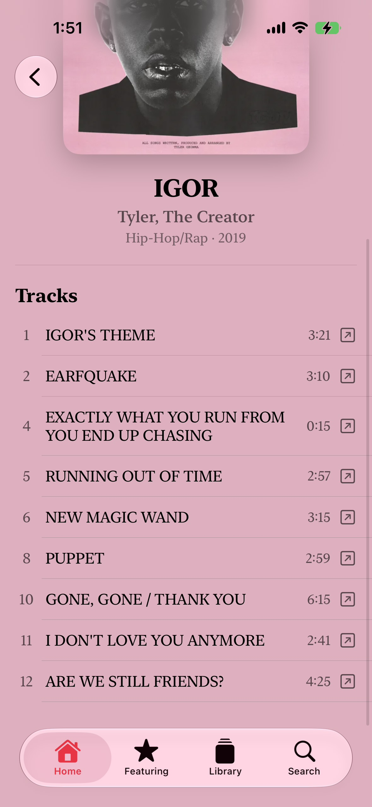
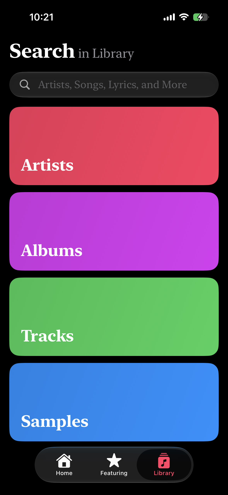

## LinerNotes

> A modern music discovery app for exploring samples, production details, and the creative connections behind your favorite songs.

LinerNotes is a SwiftUI-based music application designed to make the hidden details behind music easier to discover.

Music is rarely created in isolation. A song can contain a sample from decades ago, reference another artist's work, or use production techniques that connect it to an entirely different record. LinerNotes is designed around these connections, bringing music discovery, metadata, samples, and production information into one focused experience.

> [!WARNING]
> **This repository does not contain the production backend.**
>
> The public version of LinerNotes uses a **local JSON / localhost-based data source** for development and demonstration.
>
> The production version relies on **CloudKit and other third-party services** to provide music metadata, sample information, and related content. These services, databases, and production configurations are not included in this repository.
>
> As a result, cloning this repository will **not provide the same backend environment as the production version**. You will need to configure your own local data source and services if you want to run the project.
>
> I will periodically publish updated datasets and configuration instructions (json files) based on my music taste or any recommendation to keep the public repository usable as the project evolves. 
>
> **The purpose of this repository is to showcase the project, its architecture, UI, and development process—not to provide a complete production backend.**
>
> **Have an idea or suggestion? I'd love to hear it.**

## Why LinerNotes?

Music contains countless connections that are easy to miss — a sample hidden beneath a modern production, a production technique carried across generations, or an artist reinterpreting an earlier recording.

LinerNotes was created to make these connections easier to explore and understand.

Instead of treating a song as an isolated recording, LinerNotes focuses on the information surrounding it and the creative relationships that make music history interesting.

---

<div align="center">

  <div>
    
    
    
    
  </div>

  <br>

  <div>
    
    
    
    
  </div>

</div>

## Features

### 🎵 Music Discovery

Explore music through a clean, native Apple-platform interface designed around discovery and exploration.

### 🔎 Universal Search

Search across music-related content from a unified search experience.

### 🎚️ Sample Exploration

Discover the recordings, musical ideas, and creative works that appear behind other songs.

### 📝 Production Details

Explore information that helps explain how a track was created and what went into its production.

### 🔗 Creative Connections

Discover relationships between:

- Songs
- Artists
- Albums
- Samples
- Production details
- Related recordings


### 🍎 Native Apple Design

LinerNotes is built with SwiftUI and follows a native Apple-platform design philosophy, with an emphasis on clarity, hierarchy, and fluid interaction.

## Demo

https://github.com/user-attachments/assets/ad9b3178-876a-4c62-8f5d-bdc1cb961534

---

## Tech Stack

LinerNotes is built using Apple's native development ecosystem.

- **Swift**
- **SwiftUI**
- **Xcode**
- Apple platform frameworks and APIs

The project is structured to keep the user interface, application logic, data, models, and local database functionality separated as the application evolves.

---

## Project Structure

```text
LinerNotes/
├── LinerNotes.xcodeproj
│
└── LinerNotes/
    │
    ├── 0_LocalDatabase/
    │
    ├── 1_Views/
    │
    ├── 2_Data/
    │
    ├── 3_Models/
    │
    ├── 4_App/
    │
    ├── 5_LocalDatabase/
    │
    ├── Assets.xcassets
    │
    └── Info.plist
```

### Directory Overview

| Directory | Purpose |
|---|---|
| `0_LocalDatabase` | Local data and database-related functionality |
| `1_Views` | SwiftUI views and user interface components |
| `2_Data` | Data handling and related application resources |
| `3_Models` | Data models and application entities |
| `4_App` | Application-level functionality and configuration |
| `5_LocalDatabase` | Additional local database functionality |
| `Assets.xcassets` | Images, icons, colors, and other asset resources |
| `Info.plist` | Application configuration |

The project structure may evolve as development continues.

---

## Design Philosophy

LinerNotes is designed around three principles:

### 1. Discovery

Music metadata should encourage curiosity rather than interrupt it.

### 2. Context

A song becomes more interesting when its history and creative relationships are visible.

### 3. Simplicity

Complex information should be presented through a focused and understandable interface rather than overwhelming the user.

The goal is to make exploring music feel as natural as listening to it.

---

## Screenshots

Screenshots and product demonstrations will be added as the project develops.

### App Interface

*Coming soon.*

### Search

*Coming soon.*

### Sample Exploration

*Coming soon.*

---

## Getting Started

### Requirements

- macOS
- Xcode
- A compatible Apple-platform SDK

### Installation

Clone the repository:

```bash
git clone https://github.com/rogeryeoh49-bot/LinerNotes.git
```

Open the Xcode project:

```text
LinerNotes.xcodeproj
```

Then:

1. Open the project in Xcode.
2. Select a compatible simulator or connected Apple device.
3. Select the appropriate build target.
4. Build and run the application.

---

## Development

LinerNotes is an actively developed project.

The architecture, user interface, data sources, and functionality may change as development continues.

The project is organized into separate areas for:

- User interface
- Data
- Models
- Application logic
- Local database functionality

The repository represents the current development state of the project rather than a final production release.

---

## Project Status

**🚧 In Development**

LinerNotes is currently under active development.

Planned improvements may include:

- Expanded music metadata
- More detailed sample relationships
- Additional production information
- Improved search
- Expanded music discovery features
- Additional Apple-platform integrations
- UI and interaction refinements
- Performance improvements

Features and priorities may change throughout development.

---

## Roadmap

### Phase 1 — Foundation

- [x] Establish SwiftUI application architecture
- [x] Build core navigation
- [x] Develop the initial search experience
- [x] Establish data and model layers
- [x] Establish local database functionality

### Phase 2 — Music Discovery

- [ ] Expand music discovery
- [ ] Improve search and filtering
- [ ] Improve music metadata presentation
- [ ] Expand artist and album relationships

### Phase 3 — Samples & Production

- [ ] Expand sample relationships
- [ ] Improve sample discovery
- [ ] Add more production information
- [ ] Improve connections between related recordings

### Phase 4 — Refinement

- [ ] UI refinement
- [ ] Performance optimization
- [ ] Improved animations and interactions
- [ ] Accessibility improvements
- [ ] Additional Apple-platform integrations
- [ ] Finalize the public release

---

## Technical Goals

Beyond its user-facing functionality, LinerNotes is also an exploration of how structured music information can be presented through a modern native application.

The project focuses on:

- Modular SwiftUI architecture
- Separation of data and presentation
- Local data management
- Search and discovery interfaces
- Music metadata organization
- Native Apple-platform interaction patterns
- Maintainable application architecture
- Scalable application structure

---

## Motivation

The idea behind LinerNotes came from a simple observation:

> There is often much more to a song than what we hear in its final recording.

A few seconds of audio can connect decades of music history. A production choice can reveal an unexpected influence. A sample can turn a modern track into a conversation with an older recording.

LinerNotes aims to make those connections easier to find.

---

## Project Philosophy

LinerNotes is not intended to replace the experience of listening to music.

It is intended to make the experience of **being curious about music** more rewarding.

The project explores how software can turn music metadata into something that encourages people to keep discovering.

---

## Privacy & Security

No API keys, access tokens, passwords, or other private credentials should be committed to this repository.

If you are developing locally and need private configuration or credentials, keep those values outside the public repository.

**Never commit secrets to Git.**

---

## Contributing

LinerNotes is currently maintained as an independent project.

The repository is public primarily for transparency, development documentation, and portfolio purposes.

At this stage, external contributions are not formally solicited. This may change as the project matures.

---

## License

Copyright © 2026 Roger Yeoh. All rights reserved.

This repository is publicly available for viewing and educational reference.

No license is granted to copy, modify, redistribute, sublicense, publish, or use the source code or any substantial portion of it in another project without explicit written permission from the copyright holder.

The public availability of this repository does not constitute permission to use, reproduce, modify, or distribute the source code.

---

## Author

**Roger Yeoh**

LinerNotes is an independent software project exploring the intersection of:

- Music discovery
- Music metadata
- Sampling
- Production information
- Software engineering
- Native Apple-platform design

<p align="left">
  <a href="https://rogeryeoh.dpdns.org">
    <strong>🌐 know more about me if you wish →</strong>
  </a>
</p>

---

## Acknowledgements

LinerNotes is inspired by the idea that music becomes more meaningful when its history and creative connections are easier to explore.

Built with **SwiftUI** and **Xcode**.

---

<p align="center">
  <strong>LinerNotes</strong><br>
  Discover the stories behind the music.
</p>
